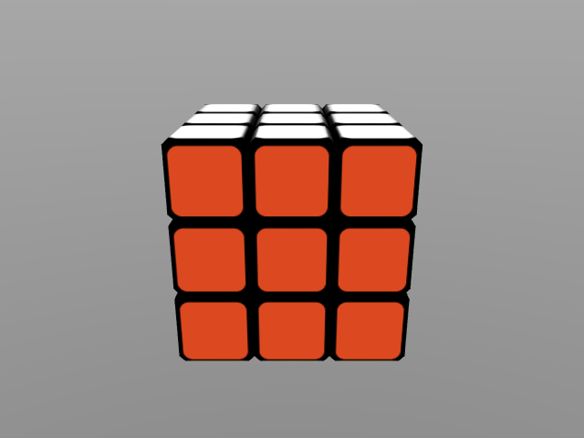

# MuJoCo 3x3x3 魔方

[![build][tests-badge]][tests]
[![build][mujoco-version]][MuJoCo]

[tests-badge]: https://github.com/kevinzakka/mujoco_cube/actions/workflows/ci.yml/badge.svg
[tests]: https://github.com/kevinzakka/mujoco_cube/actions/workflows/ci.yml
[mujoco-version]: https://img.shields.io/badge/MuJoCo-v2.3.3-blue

[MuJoCo] 3x3x3 魔方的模型，以及用于程序生成它的脚本。受 [Rubik's Cube] 启发。

<p float="left">
  
</p>

## 要求

您需要 MuJoCo 版本 2.3.3 或更高以运行模型。如果您想使用较旧版本，请将 `implicitfast` 积分器替换为 `Euler`。

## 使用模型

只需将 `cube_3x3x3.xml` 文件拖放到模拟窗口中。

## 生成模型

首先安装依赖项：

```bash
pip install -r requirements.txt
```

然后运行以下命令来生成资产和 XML 文件：

```bash
python build_textures.py  # 创建 assets/ 目录。
python build_mjcf.py  # 创建 cube_3x3x3.xml。
```

## 魔块设计

使用 Solidworks 设计了 `cubelet.stl`。它的大小为 1.9 cm，具有 1.425 mm 的倒角边。魔方被导出为 STL 文件，并通过 `process_mesh.py` 处理以获取 MJCF 文件中 `mesh` 属性所需的顶点。

[MuJoCo]: https://github.com/deepmind/mujoco
[Rubik's Cube]: https://en.wikipedia.org/wiki/Rubik%27s_Cube
